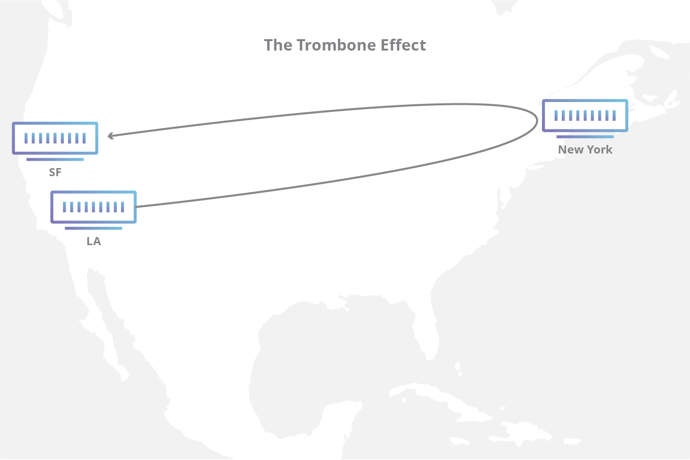

# Milestone 6

# Table of Contents

- [CDN (Content Delivery Network)](#cdn-content-delivery-network)
  1.  [Components of a CDN](#components-of-a-cdn)
      - [Origin Server](#origin-server)
      - [Edge Servers](#edge-servers)
      - [PoPs (Points of Presence)](#pops-points-of-presence)
  2.  [Benefits of Using a CDN](#benefits-of-using-a-cdn)
      - [Faster Load Times](#faster-load-times)
      - [Scalability](#scalability)
      - [Reliability](#reliability)
  3.  [DDOS Protection](#ddos-protection)
      - [Stages in Mitigating DDoS Attacks](#stages-in-mitigating-ddos-attacks)
        - [Detection](#detection)
        - [Response](#response)
        - [Routing](#routing)
        - [Adaptation](#adaptation)
  4.  [CDN as a Reverse Proxy](#cdn-as-a-reverse-proxy)
      - [Internet Exchange Points (IXPs)](#internet-exchange-points-ixps)
        - [Trombone Effect](#trombone-effect)
  5.  [Border Gateway Protocol (BGP)](#border-gateway-protocol)
      - [Autonomous Systems](#autonomous-systems)
      - [BGP and TCP](#bgp-and-tcp)
        - [SYN](#syn)
        - [SYN + ACK](#syn--ack)
        - [ACK](#ack)

## CDN (Content Delivery Network)

- A Content Delivery Network (CDN) is a network of servers distributed across the globe to deliver content to users quickly. CDNs are used to cache static assets like images, CSS, and JavaScript files.

- The primary goal of a CDN is to reduce latency and improve website performance.

### Components of a CDN

1. **Origin Server** - The server where the original content is stored.

2. **Edge Servers** - Servers located in different geographical locations to cache content and deliver it to users quickly.

3. **PoPs (Points of Presence)** - Data centers where edge servers are located.

### Benefits of Using a CDN

1. **Faster Load Times** - Content is delivered from the nearest edge server, reducing latency.

2. **Scalability** - CDNs can handle high traffic loads and distribute content efficiently.

3. **Reliability** - CDNs provide redundancy and failover mechanisms to ensure content availability.

#### DDOS Protection

- A distributed Denial of Service attack is an attempt to overwhelm a website or server with traffic from multiple sources. CDNs can help mitigate DDoS attacks by distributing traffic across multiple servers.

#### 4 Stages in mitigating DDoS attacks

1. **Detection** - Identifying abnormal traffic patterns and distinguishing between legitimate and malicious traffic.

2. **Response** - Implementing countermeasures to mitigate the attack and protect the network.

3. **Routing** - Redirecting traffic through scrubbing centers to filter out malicious traffic.

4. **Adaptation** - Adjusting security measures based on the evolving nature of DDoS attacks.

### CDN as a Reverse Proxy

- A reverse proxy is a server that sits between clients and the origin server, forwarding client requests to the origin server and caching responses to improve performance.

- CDNs act as reverse proxies by caching content at edge servers and delivering it to users, reducing the load on the origin server and improving response times.

- CDNs also route traffic to the nearest edge server based on the user's location, further reducing latency.

#### Internet exchange points (IXPs)

- Internet exchange points are physical locations where different Internet service providers (ISPs) connect and exchange traffic. IXPs facilitate the exchange of data between networks and improve network performance.

- **Trombone Effect**: The trombone effect occurs when traffic is routed inefficiently, causing data packets to travel long distances before reaching their destination. CDNs help reduce the trombone effect by routing traffic through the nearest edge server.
  

### Border Gateway Protocol

- BGP is the postal service of the internet, it efficiently routes traffic over the network through Autonomous Systems (AS).

### Autonomous Systems

- These are like local post offices that handle traffic within a specific region or network. It helps BGP route traffic efficiently.

#### BGP and TCP

- BGP uses the Transmission Control Protocol (TCP) to establish connections between routers and exchange routing information. TCP ensures reliable data transmission and error detection.

- TCPs three-way handshake is used to establish a connection between routers before exchanging BGP routing updates.

1. **SYN** - Client sending Synchronize Sequence Number to inititate the communication.

2. **SYN + ACK** - The server responds with it SYN and an acknowledgement of the request to initiate the connection.

3. **ACK** - Client acknowledges the response received from the server and they both establish a connection.
